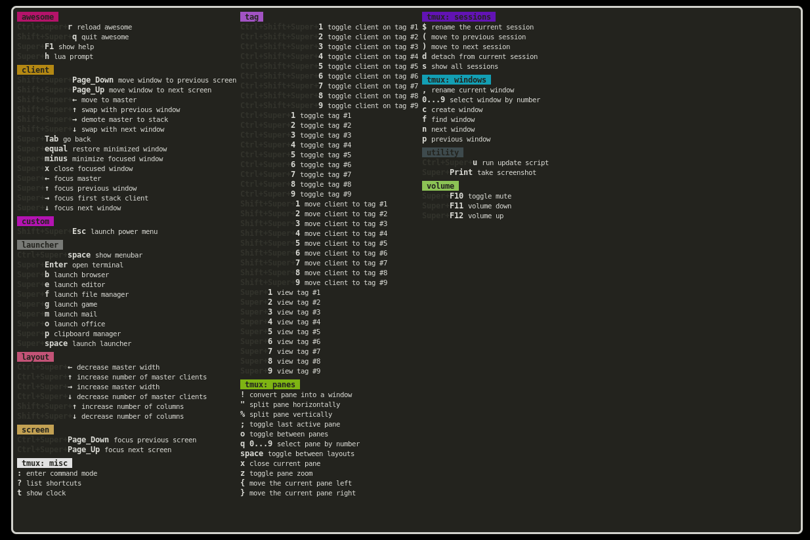

# myawesome
Modular AwesomeWM Configuration 

Configure using the modules the rc.lua acts as a hub with menu settings

I've tried my best to give a small snippet about what everything is doing in the config as well, making config files alot easier to understand and modify  

the apps.lua and autostartup.lua is used for MY most used apps and is to be used as an example, putting apps in apps.lua will be reflected in kinybinding (keys.lua) I've set 

